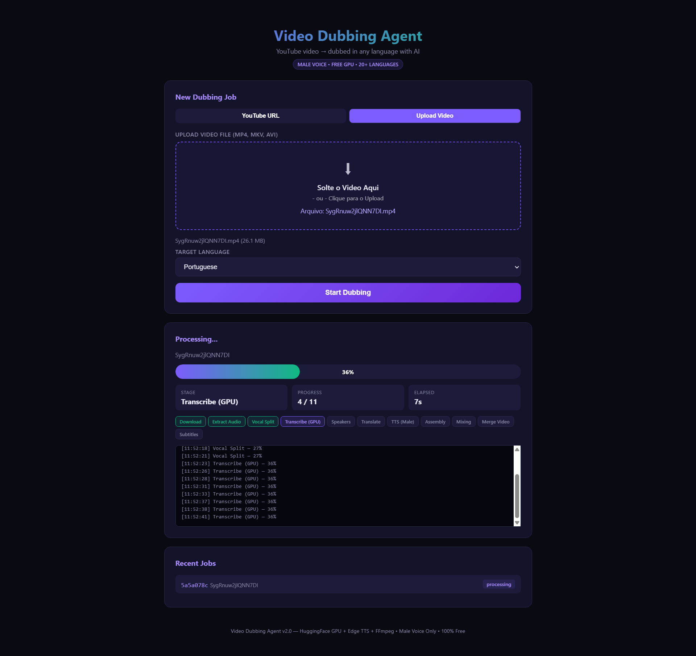

# Video Dubbing Agent — Colab

[](https://colab.research.google.com/github/ssousa455/video_dubbing_agent_colab/blob/main/video_dubbing_agent_colab.ipynb)

Tradução e dublagem automática de vídeos usando IA. Basta enviar um vídeo e escolher o idioma de destino — o sistema transcreve, traduz e gera áudio dublado sincronizado.

Baseado no Space [sauravghu/video-dubbing-agent](https://huggingface.co/spaces/sauravghu/video-dubbing-agent) do Hugging Face, adaptado para rodar no Google Colab.

## Interface



## Como usar (passo a passo)

1. Clique no botão **"Open in Colab"** acima
2. No Colab, vá em **Runtime > Run all** (ou pressione `Ctrl+F9`)
3. Aguarde as instalações (pode levar alguns minutos na primeira vez)
4. Quando tudo estiver pronto, aparecerá um link **URL PÚBLICA** no estilo:
   ```
   URL PÚBLICA (cloudflared): https://cruz-forbes-village-produced.trycloudflare.com
   ```
5. **Clique nesse link** para abrir a interface do programa no seu navegador
6. Na interface, envie o vídeo, escolha o idioma de destino e clique em **Start Dubbing**
7. O vídeo dublado será processado e baixado automaticamente

## Configuração de logs

Para controlar a quantidade de informações de debug exibidas durante a execução, adicione esta célula **antes** da Célula 7 e execute:

```python
import os
os.environ["VDA_LOG_LEVEL"] = "DEBUG"    # máximo de detalhes
os.environ["VDA_LOG_LEVEL"] = "INFO"     # padrão
os.environ["VDA_LOG_LEVEL"] = "WARNING"  # menos ruído
os.environ["VDA_LOG_LEVEL"] = "ERROR"    # só erros
```

## Limitações

- **Tamanho máximo do arquivo: 100 MB** (limite do Google Colab para upload)
- O tempo de processamento depende do tamanho do vídeo e da GPU alocada
- Funciona melhor com vídeos curtos (até ~10 minutos)
- A qualidade da dublagem depende da qualidade do áudio original

## Requisitos

- Conta gratuita no [Google Colab](https://colab.research.google.com/)
- Navegador moderno (Chrome, Firefox, Edge)
- Não é necessário instalar nada no seu computador

## Licença

Este projeto é uma adaptação do [video-dubbing-agent](https://huggingface.co/spaces/sauravghu/video-dubbing-agent) de Saurav Ghosh, licenciado sob as licenças dos componentes originais.
